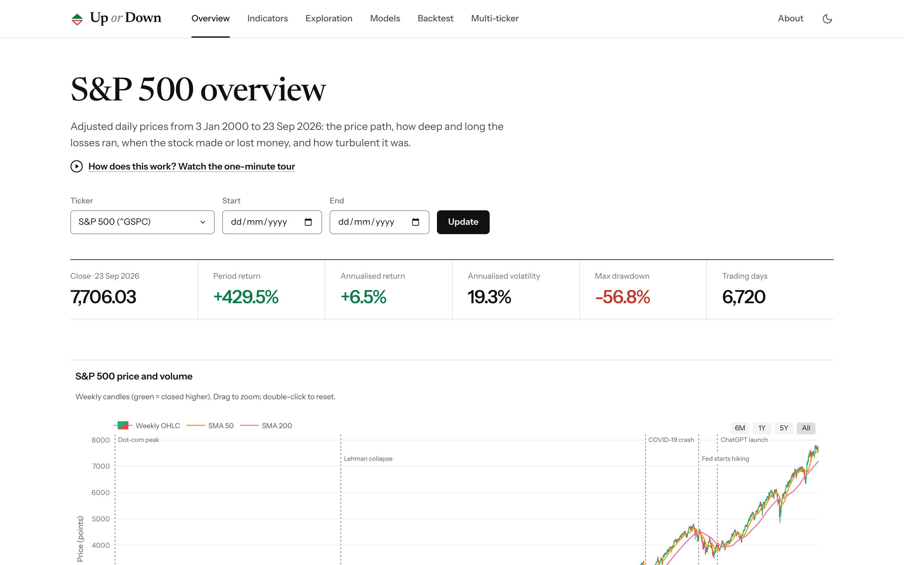
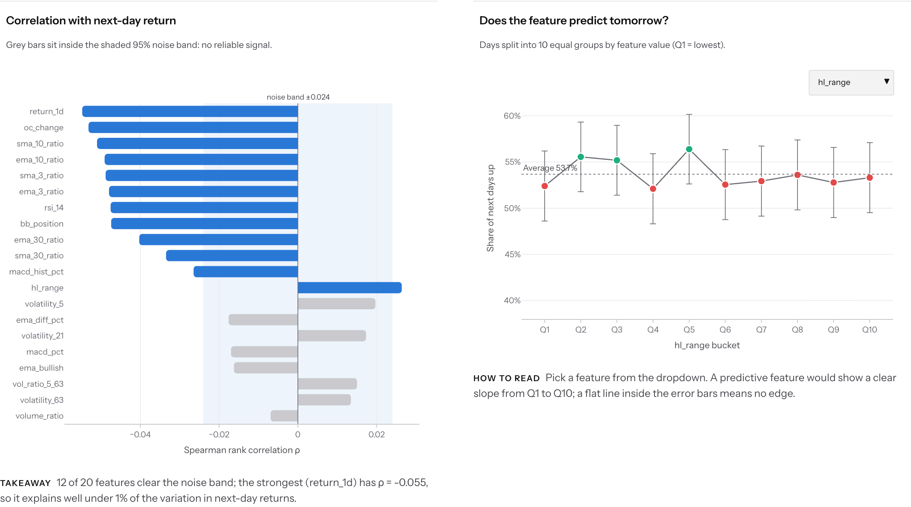
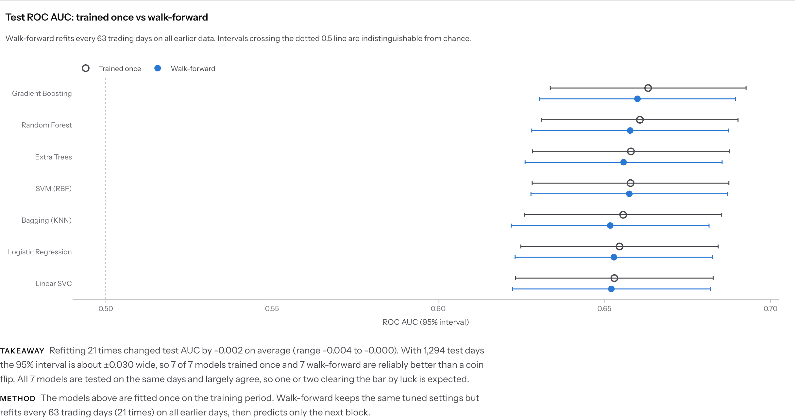
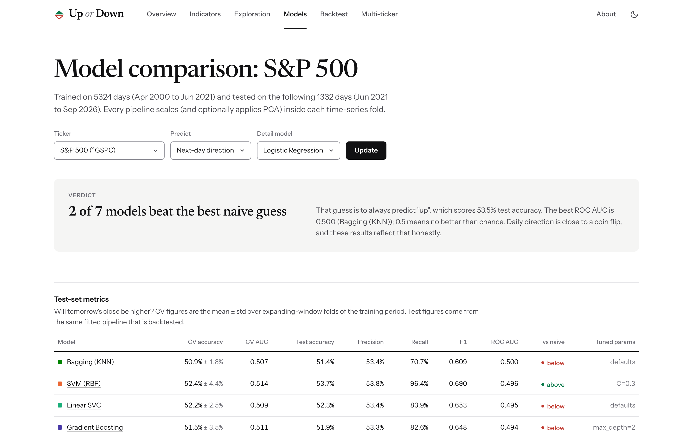
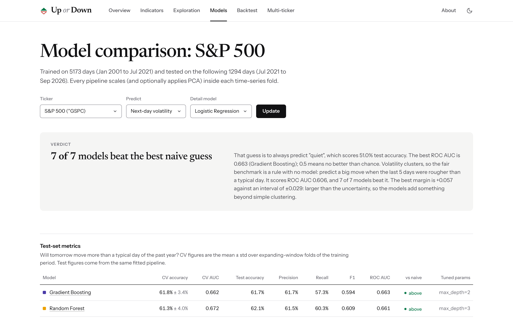
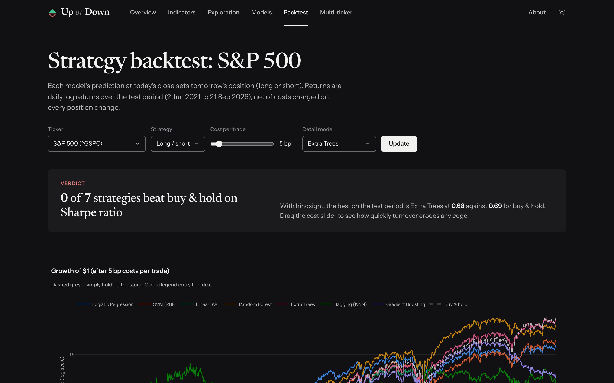

# Up or Down

**Live demo: [upordown.hashimsalim.com](https://upordown.hashimsalim.com/)**

Will tomorrow's close be higher than today's? Up or Down trains seven machine-learning models to
answer that for the S&P 500 and four large US tech stocks. It backtests a trading strategy built
on their answers and shows every step in an interactive Django + Plotly dashboard. The core
Python package is `stockml`.



The honest headline: **next-day direction is close to a coin flip**, and the site says so on
every page. A second target, **whether tomorrow will be a big move**, turns out to be genuinely
predictable, and the models beat a no-model benchmark there. The project's goal is a sound,
leak-free method and clear communication, not a money-printing model.

## What it does

1. **Predicts.** Each trading day becomes 20 technical features computed from that day's close
   and earlier. Seven classifiers learn two yes/no targets from them: next-day direction and
   next-day volatility.
2. **Backtests.** The direction models trade long/short (or long/flat) on their own predictions,
   net of transaction costs, against buy & hold.
3. **Explains.** Six dashboard pages and an About page with a one-minute video show the data,
   the features, the models and the backtest as interactive charts. Each chart has a caption,
   computed from the data, that states the takeaway, including when a model does no better than
   a naive guess.

## Data

| Ticker | Name | Quoted in | History |
|---|---|---|---|
| `^GSPC` | S&P 500 index | index points | 2000 → today |
| `AMZN` | Amazon | USD | 2000 → today |
| `MSFT` | Microsoft | USD | 2000 → today |
| `GOOGL` | Alphabet (Google), class A | USD | Aug 2004 (IPO) → today |
| `ORCL` | Oracle | USD | 2000 → today |

Prices are daily OHLCV from Yahoo Finance, adjusted for splits and dividends: about 32,000 daily
bars in total, cached as Parquet. Downloads run up to the **system date** (`DataConfig.end`
defaults to tomorrow, because yfinance treats `end` as exclusive), and the deployed site refreshes
every weeknight. Bad ticks are flagged by a volatility-scaled z-score that also requires an
immediate reversal, so genuine crashes such as 2008 and 2020 are kept. The universe, dates,
display names and units are all set in `src/stockml/config.py`.

## Prediction targets

| Target | Label at day *t* is 1 when… | Naive benchmarks it must beat |
|---|---|---|
| **Next-day direction** (`price_rise`) | close *t+1* > close *t* | Always predicting the more common class in the test period |
| **Next-day volatility** (`big_move`) | \|log return *t → t+1*\| is larger than the median absolute daily return over the past 252 days (a "typical day" of the past year, measured up to *t*) | The majority class, plus a *persistence rule* with no model: predict a big move when the last 5 days were rougher than a typical day |

The persistence rule is there because volatility clusters. Calm days tend to follow calm days and
rough days follow rough days, so a volatility model is only interesting if it beats that simple
rule. The final day has no next-day label and is dropped.

## Features

Every feature at row *t* uses only data available at the close of day *t*. Tests enforce this
by changing future prices and asserting that no earlier feature moves. Features that depend on
price level are expressed relative to the close, so they are roughly stationary and comparable
across decades and across tickers.

| Family | Features | What it captures |
|---|---|---|
| Today's bar | `hl_range` (high − low) / close, `oc_change` (close − open) / open, `return_1d` (log return) | How wide and in which direction today moved |
| Trend | `sma_{3,10,30}_ratio`, `ema_{3,10,30}_ratio`: close / moving average − 1 | How stretched the price is above or below its recent average |
| Momentum | `rsi_14` (Wilder smoothing), `macd_pct`, `macd_hist_pct` (MACD 12/26/9 as a share of the close), `ema_bullish` (1 when the 10-day EMA is above the 30-day), `ema_diff_pct` | Speed and direction of recent moves, and trend state |
| Bands | `bb_position`: where the close sits in its 20-day, 2σ Bollinger band | Short-term overbought or oversold |
| Volatility | `volatility_{5,21,63}`: realised volatility over about a week, a month and a quarter; `vol_ratio_5_63` | How rough the market is, and whether this week is rougher than the quarter around it |
| Participation | `volume_ratio`: volume / 20-day average volume | Unusual trading activity |

All windows live in `FeatureConfig`, and features are always selected by name, never by column
position.

### How the features were chosen

The feature set is chosen **up front, from standard technical-analysis ideas**. It covers the
five things a trader might read from a chart: the day's bar, trend, momentum, band position and
volatility, plus volume. Each family uses short, medium and long windows. The 21- and 63-day
volatility measures and their ratio to the 5-day measure were added for the volatility target:
volatility clusters, so recent roughness relative to the longer run is the natural predictor.

There is **no automatic feature-selection step** (RFE, SelectKBest and similar). The reasons:

- **The direction signal is too weak to select on.** Over the full history, between 0 (Alphabet)
  and 12 (S&P 500) of the 20 features have a rank correlation with the next day's return outside
  the 95% noise band. The strongest, |ρ| = 0.066, explains under 0.5% of the variance. A
  selection step fitted to correlations that small mostly learns noise, and dropping features
  also hides the honest "nothing works" result.
- **Redundancy is handled by the models instead.** Several features are near-twins (for example
  `ema_diff_pct` and `macd_pct`, and each SMA/EMA ratio pair, all with ρ above 0.95). The linear
  models are regularised with a tuned `C`, the tree ensembles are indifferent to duplicates, and
  the one distance-based model (KNN) first compresses the features with PCA to 5 components.
- **Identical inputs keep comparisons fair.** Every model, ticker and target sees the same 20
  columns, so differences in results come from the models, not the inputs.

Features are instead **checked after the fact**, never against the test set:

- The **Exploration** page ranks each feature's correlation with the next day's return against
  the noise band. It shows the next-day up-rate by feature decile and a redundancy heatmap.
- The **Models** page shows **permutation importance** measured on the last cross-validation
  fold of the training period. For direction, the most important features are the day's own move
  (`return_1d`, `oc_change`), and even they are tiny: shuffling one costs at most about 0.03 ROC AUC.
  For volatility, the medium-term volatility, trend state and band features (`volatility_21`,
  `ema_bullish`, `bb_position`) come first.



## Models

Every model is an sklearn `Pipeline` of `StandardScaler → [PCA] → estimator`. All preprocessing
is therefore fitted inside each training fold and never sees validation or test data. The
registry (`src/stockml/models/registry.py`) builds the same pipelines for both targets.

| Model | Settings | Tuned by time-series CV | Why it's in the line-up |
|---|---|---|---|
| Logistic Regression | L2 penalty | `C` ∈ {0.01, 0.1, 1} | Linear, interpretable baseline with probability outputs |
| Linear SVC | `C = 0.1` | — | Linear max-margin alternative to logistic regression |
| SVM (RBF) | RBF kernel, `gamma="scale"` | `C` ∈ {0.3, 1, 3} | Smooth non-linear boundaries |
| Random Forest | 300 trees, `min_samples_leaf=20` | `max_depth` ∈ {3, 6} | Non-linear interactions; shallow trees and large leaves resist fitting noise |
| Extra Trees | 300 trees, depth 6, `min_samples_leaf=20` | — | More randomised splits, so lower variance than a random forest |
| Bagging (KNN) | 20 × 25-nearest-neighbours on half-samples, after PCA to 5 components | — | Local, similarity-based view: "what happened after days like this?" |
| Gradient Boosting | 200 trees, learning rate 0.03, subsample 0.7 | `max_depth` ∈ {2, 3, 5} | Strong tabular learner, kept shallow and slow to avoid overfitting |

Grids are deliberately small. With signal this weak, a big search mostly finds settings that got
lucky on one fold. Every model uses a fixed `random_state` (101), so runs are reproducible.

## Training and evaluation

For each ticker and target, `run_experiment()` (`src/stockml/experiment.py`) does the following:

1. **Builds `(X, y)`.** It computes features and the label, and drops indicator warm-up rows and
   the final unlabelled day.
2. **Splits chronologically.** The first 80% of days are the training period and the last 20%
   are the test period, roughly mid-2021 (2022 for Alphabet) to the latest close. There is no shuffling anywhere.
3. **Tunes and cross-validates** on the training period only. `GridSearchCV` uses a 5-fold
   expanding-window `TimeSeriesSplit` scored by ROC AUC. The chosen configuration's CV accuracy,
   ROC AUC and F1 are recorded per fold, then it is refitted on the whole training period.
4. **Tests once.** It scores the fitted pipeline on the unseen test period: accuracy, precision,
   recall, F1, ROC AUC and the confusion matrix, next to the naive benchmarks. This same fitted
   pipeline is also the one that is backtested and plotted.
5. **Walks forward.** A second test period evaluation refits each model every 63 trading days
   (about a quarter) on all earlier data and predicts only the next block. This is closer to how
   a model would really be used.
6. **Measures permutation importance** on the last CV fold of the training period, never on the
   test set.
7. **Picks a model per ticker by training-period CV ROC AUC**, never by test results. Test
   numbers therefore stay genuinely out of sample.



## Results

These numbers come from the latest run, with test periods from mid-2021 to September 2026. They
shift slightly each time the data is refreshed and the models retrained.

| | Next-day direction | Next-day volatility |
|---|---|---|
| Test accuracy, 35 model × ticker pairs | 48.6% – 53.9% | 52.2% – 62.1% |
| Test ROC AUC, 35 pairs | 0.48 – 0.53 | 0.54 – 0.66 |
| CV-picked model beats the majority-class guess | 0 of 5 tickers | 5 of 5 tickers |
| CV-picked model beats the persistence rule (ROC AUC) | n/a | 4 of 5 (Amazon ties: 0.575 vs 0.576) |
| Walk-forward ROC AUC of the CV-picked models | 0.48 – 0.50 | 0.57 – 0.66 |

- **Direction is a coin flip.** Models score at or below always guessing the more common
  direction, and walk-forward refitting does not change that. The S&P 500 shows slight
  short-term mean reversion (a gain today nudges tomorrow down), but it is far too small to
  trade.
- **Volatility is predictable.** On the S&P 500 all seven models beat the persistence rule
  (best ROC AUC 0.66 against 0.61), and the gap is larger than its 95% interval. The edge holds
  under walk-forward refitting. This is expected, because volatility clusters, and it is the one
  place where the models add something real.

<table>
  <tr>
    <td width="50%"></td>
    <td width="50%"></td>
  </tr>
  <tr>
    <td>Direction: ROC AUC 0.50, no better than chance.</td>
    <td>Volatility: every model beats both benchmarks.</td>
  </tr>
</table>

## Backtest

The direction models' predictions become positions. A predicted rise at the close of *t* goes
long, and a predicted fall goes short (`long_short`) or to cash (`long_flat`). The position
earns the log return from *t* to *t+1*. A cost in basis points (5 by default) is charged on every
unit of position change, including the first entry. Sharpe and Sortino ratios are annualised with
√252, max drawdown is taken on the equity curve, and Calmar is annualised return divided by max
drawdown.

On the S&P 500 at 5 bp, none of the seven strategies beats buy & hold's Sharpe ratio of 0.69.
The best, chosen with hindsight, reaches 0.68. The cost-sensitivity chart and a live cost slider
show how quickly turnover wipes out any small edge.



## Dashboard pages

Each chart has a one-line "how to read this" subtitle, and key charts carry a takeaway computed
from the data. Pages open in the light theme; a header toggle switches to dark and remembers the
choice. Phones get a dedicated layout.

1. **Overview**: candlesticks with 50/200-day averages and market events, volume, drawdown from
   the all-time high, rolling volatility, calendar-year returns and a year × month heatmap.
2. **Indicators**: SMA/EMA/Bollinger overlays, EMA crossovers, RSI with overbought/oversold
   zones, MACD, and the next-day outcome after each signal with 95% intervals.
3. **Exploration**: return autocorrelation, fat tails against a normal curve, feature
   correlation with the next-day return against a noise band, up-rate by feature decile,
   distributions by outcome, target balance and feature redundancy.
4. **Models**: switch between the direction and volatility targets. Shows the comparison table
   against the benchmarks, CV mean ± std and per-fold stability, ROC curves, rolling test
   accuracy, the walk-forward check, score separation, the confusion matrix and permutation
   importance.
5. **Backtest**: equity curves against buy & hold, a risk table, cost sensitivity, risk against
   return, drawdowns, rolling Sharpe, a daily-return histogram, monthly returns and a
   transaction-cost slider.
6. **Multi-ticker**: ticker × model heatmap, each ticker's CV-picked model against buy & hold,
   rebased prices, risk against return, and cross-ticker return correlation.

The **About** page explains the method with a timeline of the CV, test and walk-forward periods.
It lists the ground rules and the limits, and embeds a one-minute explainer video with a
transcript.

## Architecture

All data, feature, model, backtest, analysis and chart code lives in `src/stockml/`, a typed
library with no Django imports (`mypy --strict` clean). Django is a thin presentation layer:
views parse the request, call `web/dashboard/services.py` and render. Figures reach the templates
as Plotly JSON and are cached per ticker, training run and data version. Downloading and training
never happen inside a web request; they run as management commands, nightly in CI.

```
yfinance → data.loader (Parquet cache) → data.cleaning → features.pipeline → (X, y)
        → models.training (TimeSeriesSplit CV, fit) → predictions
        → evaluation.backtest + evaluation.metrics + analysis → results
        → viz.charts (Plotly figures) → dashboard.services → templates
```

## Quick start

```bash
python -m venv .venv && source .venv/bin/activate
pip install -e ".[dev]"
cp .env.example .env            # sets DJANGO_DEBUG=true and a dev secret key

python web/manage.py migrate
python web/manage.py fetch_prices                 # ^GSPC AMZN MSFT GOOGL ORCL, 2000 to today
python web/manage.py train_models --all --jobs 4  # ~1 min per ticker
python web/manage.py runserver
```

Then open http://127.0.0.1:8000.

### Keeping data current

```bash
python web/manage.py fetch_prices                 # re-download every ticker up to today
python web/manage.py train_models --all --jobs 4  # retrain so backtests include the new days
```

If you fetch during US trading hours, today's bar is provisional until the 16:00 New York close.
A running server picks up new data and new training runs automatically.

### Explainer video

The one-minute video on the About page is an HTML animation (`video/explainer.html`) in the
dashboard's own style, drawn from the real data and captured frame by frame. It is silent, with
on-screen captions, so it also works as a muted autoplay clip elsewhere. The master copy is
`video/out/stockml-explainer.mp4` (1920 × 1080, H.264); the site serves a copy from
`web/dashboard/static/dashboard/video/`. To re-render it after new data or design changes:

```bash
pip install -e ".[video]"                       # Playwright + a bundled ffmpeg; uses your installed Chrome
python web/manage.py runserver                  # in another terminal
python video/export_data.py                     # real numbers -> video/build/data.js
python video/capture_pages.py --site http://127.0.0.1:8000   # dashboard screenshots
python video/render_video.py                    # ~2 minutes: MP4 + poster, copied into static
```

Open `video/explainer.html` in a browser to watch the animation live (`?t=20` holds one frame;
space pauses, arrow keys step), or run `render_video.py --stills 4 20 45` to save a few frames.
If the numbers change, update the transcript in
`web/dashboard/templates/dashboard/_video_transcript.html` to match.

### Management commands

| Command | What it does |
|---|---|
| `fetch_prices [TICKER ...] [--start DATE] [--end DATE] [--use-cache]` | Downloads daily prices into `data/prices/*.parquet` and records ticker metadata. With no tickers it fetches the default universe. It re-downloads to today unless you pass `--use-cache`. |
| `train_models (--ticker T ... \| --all) [--models M ...] [--no-tune] [--jobs N]` | Trains the registered models for each ticker, then saves the fitted pipelines, test-set predictions and metrics as a new training run. |
| `remove_tickers TICKER ... [--delete-files]` | Removes tickers and their training runs from the dashboard. With `--delete-files` it also deletes their cached prices and saved models. |

Example of adding a stock: `fetch_prices NVDA --start 2010-01-01`, then `train_models --ticker NVDA`.
Add a display name for it in `TICKER_NAMES` in `config.py`, or it shows as the raw symbol.

### Quality checks

```bash
ruff check . && ruff format --check .
mypy src
pytest
```

The tests use synthetic prices and never touch the network (yfinance is mocked).

### Production-style run

```bash
DJANGO_DEBUG=false DJANGO_SECRET_KEY=... python web/manage.py collectstatic --noinput
DJANGO_DEBUG=false DJANGO_SECRET_KEY=... python web/manage.py runserver --insecure  # or gunicorn config.wsgi
```

WhiteNoise serves static files, so `DEBUG=False` works without a separate web server.

### Deploying (Google Cloud Run)

The live dashboard runs on Google Cloud Run. It scales to zero when nobody is visiting, so
portfolio-level traffic stays inside the free tier (2 million requests, 180,000 vCPU-seconds and
360,000 GiB-seconds a month). The container only serves pages.
[`.github/workflows/deploy.yml`](.github/workflows/deploy.yml) runs the checks, downloads prices,
trains the models, and builds the data into the image. It pushes the image to GitHub Container
Registry (`ghcr.io/<owner>/<repo>`, public) and deploys it to Cloud Run. It runs on every push to
`main` and each weekday at 22:30 UTC, after the US close. If the download or training fails,
nothing is deployed and the site keeps the previous day's data. GitHub signs in to Google Cloud
through Workload Identity Federation, so no key file is stored anywhere.

One-time setup:

1. In the [Google Cloud console](https://console.cloud.google.com), create a project and link a
   billing account (Cloud Run requires one, even within the free tier). Note the project ID.
2. Open Cloud Shell (the terminal icon at the top right of the console), then download and run
   the setup script:

   ```bash
   curl -fsSLO https://raw.githubusercontent.com/<owner>/<repo>/main/deploy/gcp-setup.sh
   bash gcp-setup.sh <project-id> <owner>/<repo>
   ```

   The region defaults to `europe-west2` (London). Pass a third argument to change it.
3. The script prints four values. In this GitHub repo, go to Settings → Secrets and variables →
   Actions → **Variables** and add them: `GCP_PROJECT_ID`, `GCP_REGION`, `GCP_WIF_PROVIDER`,
   `GCP_SERVICE_ACCOUNT`.
4. Run the workflow (Actions → CI and deploy → Run workflow). The run summary shows the live URL,
   `https://stockml-<hash>.<region>.run.app`.
5. Set a budget alert (Billing → Budgets & alerts), for example $5 a month with email alerts, so
   any unexpected usage is caught early.

Until the variables are set, the workflow still builds and pushes the image and skips the deploy
step. The first visit after an idle period waits a few seconds while an instance starts.
`DJANGO_ALLOWED_HOSTS` defaults to `.run.app`.

To serve the site on your own subdomain (for example `upordown.example.com`):

1. Deploy in a region that supports Cloud Run domain mappings (`europe-west1`, `europe-west4`,
   `us-central1` and a few others; `europe-west2` does not). To move, set `GCP_REGION` to the new
   region, re-run the workflow, then delete the old service:
   `gcloud run services delete stockml --region <old-region>`.
2. Verify the root domain in [Google Search Console](https://search.google.com/search-console)
   (Domain property) by adding the TXT record it gives you at your DNS provider.
3. Map the subdomain in Cloud Shell:

   ```bash
   gcloud beta run domain-mappings create --service stockml --domain upordown.example.com --region <region>
   ```

4. At your DNS provider, add a `CNAME` record: host `upordown`, value `ghs.googlehosted.com.`
5. Add a repository variable `SITE_DOMAIN` = `upordown.example.com` so Django accepts the host,
   and re-run the workflow. Google issues the HTTPS certificate automatically, usually within
   15–60 minutes of DNS resolving.

To try the image locally, after `fetch_prices` and `train_models`:

```bash
docker build -t stockml . && docker run --rm -p 8000:8000 stockml
```

### Troubleshooting

- **Charts don't reflect a code change.** Figures are cached in memory by the running server,
  keyed by data and training run but not by code. Restart `runserver`.
- **The page says "No price data yet" or "No trained models yet".** Run `fetch_prices`, then
  `train_models --all`. The web app never downloads or trains during a request.
- **Port 8000 is taken.** Run `python web/manage.py runserver 8001`. The preview config in
  `.claude/launch.json` picks a free port automatically.


## Project layout

```
src/stockml/
  config.py         universe, dates, windows, model/backtest/analysis settings, ticker names/units
  data/             loader (yfinance + Parquet cache), cleaning (validation, outlier repair)
  features/         technical indicators, prediction targets, feature pipeline
  models/           registry of sklearn pipelines, time-series training, walk-forward, persistence
  evaluation/       classification + risk metrics, backtest, cost sensitivity
  analysis.py       descriptive stats for the explanatory charts
  experiment.py     end-to-end train/evaluate loop over the model registry
  viz/              theme (light palette + dark colour map) and chart builders
web/
  config/           settings (env-driven), urls, wsgi/asgi
  dashboard/        models, services, views, forms, commands, templates, static JS/CSS
tests/core          library unit tests (incl. no-leakage and hand-computed backtests)
tests/web           service and view tests
notebooks/          exploration notebook importing from stockml
docs/screenshots/   images used in this README
data/               (git-ignored) cached prices, training runs, SQLite database
deploy/             container entrypoint (gunicorn) and one-time Google Cloud setup script
video/              explainer video: animation (HTML), data export, page capture, renderer
.github/workflows/  CI checks, nightly data refresh, image build and deploy to Cloud Run
```

*Educational project: nothing here is investment advice.*
